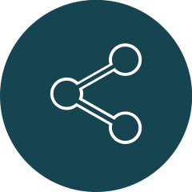

<!-- PROJECT SHIELDS -->
[![Contributors][contributors-shield]][contributors-url]
[![Forks][forks-shield]][forks-url]
[![Stargazers][stars-shield]][stars-url]
[![Issues][issues-shield]][issues-url]
[![GNU License][license-shield]][license-url]

<!-- PROJECT LOGO -->
<br />
<p align="center">
  <a href="https://github.com/AntoineMeheut/GoodDevPractices">
    
  </a>

  <h3 align="center">Python GoodDevPractices </h3>
  [](https://gitpod.io/#<your-repository-url>)

  <p align="center">
    The purpose of this program is to offer good programming practices in Python, when you want to build a program that can go to a production target. You can then look at how to structure a project and its various components. And inspire you to create a new project or improve the quality of existing projects.
    <br />
    <a href="https://github.com/AntoineMeheut/GoodDevPractices/tree/master/docs"><strong>Explore the docs</strong></a>
    <br />
    <br />
    <a href="https://github.com/AntoineMeheut/GoodDevPractices">View Demo</a>
    ·
    <a href="https://github.com/AntoineMeheut/GoodDevPractices/issues">Report Bug</a>
    ·
    <a href="https://github.com/AntoineMeheut/GoodDevPractices/issues">Request Feature</a>
  </p>
</p>

<!-- TABLE OF CONTENTS -->
## Table of Contents

* [About the Project](#about-the-project)
  * [UniqueWordList](#UniqueWordList)
* [Getting Started](#getting-started)
  * [Installation](#installation)
* [Usage](#usage)
* [Roadmap](#roadmap)
* [Contributing](#contributing)
* [License](#license)
* [Contact](#contact)
* [Acknowledgements](#acknowledgements)

<!-- ABOUT THE PROJECT -->
## About The Project

The different topics that are covered in this model are:
 
*  how to structure a project to deploy it in a production environment,
*  that must contain a file requirement_dev.txt,
*  that must contain files setup.cfg and setup.py,
*  how to individually test components of a project with pytest,
*  how to create logs that are visible on the console and also written in log files,
*  how to configure the logs with an external yaml file,
*  how to manage the exeptions of execution of a program,
*  how to document your code to make it more understandable and use Sphinx to create the documentation of your project,
*  how to structure your project to publish it in the form of a bookstore,
*  how to document the project with sample files: readme.md, authors.md, contributing.md, installation.md, usage.md, ...
 
UniqueWordList
--------------
Extract from a file in RTF format a list of all the words in the file  without repetition.
 
The object of this program is to read a text and extract the list of words without repetition. The functional interest is thus voluntarily limited, to allow a developer who wishes to take note of some good programming practices, to study them and to draw inspiration from them, without being too disturbed by the understanding of what the main program and its modules does.

<!-- GETTING STARTED -->
## Getting Started

To get a local copy up and running follow these simple steps.

### Installation
 
1. Clone the repo
```
git clone https://github.com/AntoineMeheut/GoodDevPractices
```
2. Install python packages
```
pip3 install -r requirements_dev.txt
```

<!-- USAGE EXAMPLES -->
## Usage

Clone this project to use it for your developments.

This project was structured with Cookiecutter_ to have a good example of a project in Python. You will find examples: tests components, modules structuring, documentation in the project components to then create the documentation with Sphinx and a mechanism for log management to the console and log files. Finally, this project can be packaged with Setuptools.

<!-- ROADMAP -->
## Roadmap

See the [Project](https://github.com/AntoineMeheut/GoodDevPractices/projects) for a list of proposed features (and known issues).


<!-- CONTRIBUTING -->
## Contributing

Contributions are what make the open source community such an amazing place to be learn, inspire, and create. Any contributions you make are **greatly appreciated**.

1. Fork the Project
2. Create your Feature Branch (`git checkout -b feature/AmazingFeature`)
3. Commit your Changes (`git commit -m 'Add some AmazingFeature'`)
4. Push to the Branch (`git push origin feature/AmazingFeature`)
5. Open a Pull Request


<!-- LICENSE -->
## License

Distributed under the GNU General Public License v3.0 License. See `LICENSE` for more information.

<!-- CONTACT -->
## Contact

If you want to contact me [just clic](mailto:github.contacts@protonmail.com)

Project Link: [https://github.com/AntoineMeheut/GoodDevPractices](https://github.com/AntoineMeheut/GoodDevPractices)


<!-- ACKNOWLEDGEMENTS -->
## Acknowledgements

This package was created with Cookiecutter and the `audreyr/cookiecutter-pypackage` project template.

* [Cookiecutter](https://github.com/audreyr/cookiecutter)
* [audreyr/cookiecutter-pypackage](https://github.com/audreyr/cookiecutter-pypackage)


<!-- MARKDOWN LINKS & IMAGES -->
<!-- https://www.markdownguide.org/basic-syntax/#reference-style-links -->
[contributors-shield]: https://img.shields.io/github/contributors/AntoineMeheut/GoodDevPractices?color=green
[contributors-url]: https://github.com/AntoineMeheut/GoodDevPractices/graphs/contributors
[forks-shield]: https://img.shields.io/github/forks/AntoineMeheut/GoodDevPractices
[forks-url]: https://github.com/AntoineMeheut/GoodDevPractices/network/members
[stars-shield]: https://img.shields.io/github/stars/AntoineMeheut/GoodDevPractices
[stars-url]: https://github.com/AntoineMeheut/GoodDevPractices/stargazers
[issues-shield]: https://img.shields.io/github/issues/AntoineMeheut/GoodDevPractices
[issues-url]: https://github.com/AntoineMeheut/GoodDevPractices/issues
[license-shield]: https://img.shields.io/github/license/AntoineMeheut/GoodDevPractices
[license-url]: https://github.com/AntoineMeheut/GoodDevPractices/blob/master/LICENSE
[linkedin-shield]: https://img.shields.io/badge/-LinkedIn-black.svg?style=flat-square&logo=linkedin&colorB=555
[linkedin-url]: https://www.linkedin.com/in/antoine-meheut
[product-screenshot]: images/screenshot.png
